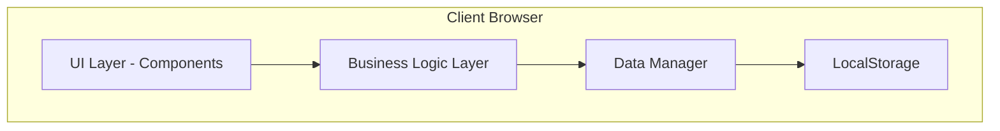

# Design Document

## Overview

The Drink Tracker is a client-side web application built with vanilla JavaScript, HTML5, and CSS3, designed to run entirely in the browser without server dependencies. The application uses browser LocalStorage for data persistence and is deployed as a static site on GitHub Pages. The architecture follows a modular component-based approach with clear separation between data management, UI rendering, and business logic.

## Architecture

### High-Level Architecture



### Technology Stack

- **Frontend Framework**: Vanilla JavaScript (ES6+) with modular architecture
- **Styling**: CSS3 with CSS Grid and Flexbox for responsive layouts
- **Data Storage**: Browser LocalStorage with JSON serialization
- **Build Tool**: Vite for development and production builds
- **Deployment**: GitHub Pages with GitHub Actions for CI/CD
- **Testing**: Vitest for unit tests, fast-check for property-based testing

### Module Structure

```
src/
├── components/          # UI components
│   ├── auth/           # Login, registration, approval
│   ├── drinks/         # Drink entry, quick add
│   ├── leaderboards/   # Various leaderboard views
│   ├── profile/        # User profile and settings
│   ├── badges/         # Badge display and management
│   ├── stats/          # Statistics and comparisons
│   └── admin/          # Admin dashboard
├── core/               # Core business logic
│   ├── auth.js         # Authentication logic
│   ├── drinks.js       # Drink entry logic
│   ├── leaderboards.js # Ranking calculations
│   ├── badges.js       # Badge award logic
│   └── stats.js        # Statistics calculations
├── data/               # Data management
│   ├── storage.js      # LocalStorage wrapper
│   ├── models.js       # Data models and validation
│   └── export.js       # Import/export functionality
├── utils/              # Utility functions
│   ├── validation.js   # Input validation
│   ├── formatting.js   # Data formatting
│   └── notifications.js # Toast notifications
└── main.js             # Application entry point
```

## Components and Interfaces

### Data Manager Interface

```javascript
class DataManager {
  // User management
  createUser(userData)
  getUser(userId)
  updateUser(userId, updates)
  getAllUsers()
  getPendingUsers()
  
  // Drink entry management
  createDrinkEntry(entryData)
  getDrinkEntry(entryId)
  updateDrinkEntry(entryId, updates)
  deleteDrinkEntry(entryId)
  getAllDrinkEntries()
  
  // Statistics
  getUserStats(userId)
  getGlobalStats()
  
  // Persistence
  save()
  load()
  export()
  import(data)
}
```

### Authentication Interface

```javascript
class AuthManager {
  register(username, email, password, profilePicture)
  login(email, password)
  logout()
  getCurrentUser()
  isAdmin()
  approveUser(userId)
  rejectUser(userId)
}
```

### Leaderboard Interface

```javascript
class LeaderboardManager {
  getConsumptionLeaderboard(drinkType)
  getPaymentLeaderboard()
  getFreeloaderLeaderboard()
  getUserRank(userId, leaderboardType)
}
```

### Badge Interface

```javascript
class BadgeManager {
  checkAndAwardBadges(userId)
  getUserBadges(userId)
  getAllBadges()
  getBadgeProgress(userId, badgeId)
}
```

## Data Models

### User Model

```javascript
{
  id: string,              // UUID
  username: string,
  email: string,
  passwordHash: string,    // Hashed password
  profilePicture: string,  // Base64 or URL
  status: 'pending' | 'approved' | 'rejected',
  isAdmin: boolean,
  createdAt: timestamp,
  approvedAt: timestamp | null
}
```

### Drink Entry Model

```javascript
{
  id: string,              // UUID
  drinkType: 'coffee' | 'beer' | 'other',
  quantity: number,
  consumers: string[],     // Array of user IDs
  payers: [{
    userId: string,
    quantity: number       // Number of drinks this payer covered
  }],
  timestamp: timestamp,
  notes: string | null,
  createdBy: string        // User ID who created the entry
}
```

### Badge Model

```javascript
{
  id: string,
  name: string,
  description: string,
  icon: string,            // Icon identifier or emoji
  rarity: 'common' | 'rare' | 'epic' | 'legendary',
  criteria: {
    type: string,          // e.g., 'total_drinks', 'streak', 'payment_ratio'
    threshold: number,
    drinkType: string | null
  }
}
```

### User Statistics Model

```javascript
{
  userId: string,
  totalDrinks: {
    coffee: number,
    beer: number,
    other: number,
    total: number
  },
  totalPaid: {
    coffee: number,
    beer: number,
    other: number,
    total: number
  },
  paymentRatio: number,    // paid / consumed
  badges: [{
    badgeId: string,
    awardedAt: timestamp
  }],
  lastActive: timestamp
}
```

## Correctness Properties

*A property is a characteristic or behavior that should hold true across all valid executions of a system—essentially, a formal statement about what the system should do. Properties serve as the bridge between human-readable specifications and machine-verifiable correctness guarantees.*


### Property 1: Registration creates pending accounts
*For any* valid user registration data (username, email, password, profile picture), submitting the registration should create a user account with status 'pending'.
**Validates: Requirements 1.2**

### Property 2: Pending accounts cannot log in
*For any* user with status 'pending', attempting to log in should be rejected with an appropriate message.
**Validates: Requirements 1.3**

### Property 3: Admin view shows all pending users
*For any* set of users, the admin pending registrations view should display exactly those users with status 'pending'.
**Validates: Requirements 1.4**

### Property 4: Approval enables login
*For any* pending user, after admin approval, the user status should be 'approved' and login should succeed.
**Validates: Requirements 1.5**

### Property 5: Drink entry persistence
*For any* valid drink entry, after submission, the entry should be retrievable from storage with all fields intact.
**Validates: Requirements 2.3, 2.4**

### Property 6: Statistics update on entry
*For any* drink entry, after saving, all affected user statistics should reflect the new entry immediately.
**Validates: Requirements 2.5**

### Property 7: Split payment sum validation
*For any* split payment entry, the sum of quantities paid by all payers must equal the total quantity of drinks.
**Validates: Requirements 3.3**

### Property 8: Split payment attribution
*For any* split payment entry, each payer's statistics should increase by exactly the number of drinks they paid for.
**Validates: Requirements 3.4**

### Property 9: Split payment display completeness
*For any* split payment entry, displaying the entry should show all payers and their respective quantities.
**Validates: Requirements 3.5**

### Property 10: Leaderboard ordering
*For any* consumption leaderboard (coffee, beer, or other), users should be ordered by total quantity consumed in descending order.
**Validates: Requirements 4.2**

### Property 11: Leaderboard consistency
*For any* change to user consumption data, the leaderboard should immediately reflect the updated rankings.
**Validates: Requirements 4.3**

### Property 12: Leaderboard entry completeness
*For any* user on a leaderboard, their entry should display username, profile picture, and total quantity.
**Validates: Requirements 4.4**

### Property 13: Payment leaderboard ordering
*For any* payment leaderboard, users should be ordered by total drinks paid for in descending order.
**Validates: Requirements 5.1**

### Property 14: Freeloader leaderboard ordering
*For any* freeloader leaderboard, users should be ordered by the ratio (consumed / paid) in descending order.
**Validates: Requirements 5.2**

### Property 15: Freeloader filtering
*For any* freeloader leaderboard, only users where consumed > paid should appear.
**Validates: Requirements 5.3**

### Property 16: Payment statistics display
*For any* payment statistics view, both absolute numbers and percentages should be displayed.
**Validates: Requirements 5.4**

### Property 17: Statistics comparison display
*For any* statistics view, money spent should include comparisons to purchasable items.
**Validates: Requirements 6.1**

### Property 18: Volume conversion accuracy
*For any* total beverage volume, the displayed conversions should be mathematically correct based on conversion factors.
**Validates: Requirements 6.2**

### Property 19: Statistics recalculation
*For any* data change affecting statistics, all comparisons should be recalculated to reflect the new values.
**Validates: Requirements 6.5**

### Property 20: Badge auto-award
*For any* user who meets badge criteria, the badge should be automatically awarded and the user notified.
**Validates: Requirements 7.1**

### Property 21: Badge display completeness
*For any* user profile, all earned badges should be displayed with their unlock dates.
**Validates: Requirements 7.2**

### Property 22: Locked badge requirements display
*For any* locked badge, the display should show the unlock requirements.
**Validates: Requirements 7.3**

### Property 23: Badge timestamp recording
*For any* awarded badge, the award timestamp should be recorded and displayed.
**Validates: Requirements 7.4**

### Property 24: Badge field completeness
*For any* displayed badge, it should show icon, name, description, and rarity level.
**Validates: Requirements 7.5**

### Property 25: Image validation
*For any* profile picture upload, invalid formats or oversized files should be rejected with an error message.
**Validates: Requirements 8.2**

### Property 26: Profile statistics display
*For any* user profile view, personal statistics should include total drinks consumed, paid for, and breakdown by type.
**Validates: Requirements 8.3**

### Property 27: Profile badges and rankings display
*For any* user profile view, earned badges and current leaderboard rankings should be displayed.
**Validates: Requirements 8.4**

### Property 28: Profile update persistence
*For any* profile update, changes should be saved to storage and reflected in all displays immediately.
**Validates: Requirements 8.5**

### Property 29: Admin user list completeness
*For any* set of users, the admin user management view should display all users with their status and statistics.
**Validates: Requirements 9.2**

### Property 30: Admin status update
*For any* admin action to approve or reject a user, the user status should update immediately.
**Validates: Requirements 9.3**

### Property 31: Entry deletion recalculation
*For any* drink entry deletion by admin, all affected user statistics and leaderboards should be recalculated correctly.
**Validates: Requirements 9.5**

### Property 32: Data persistence
*For any* data change (user, drink entry, badge award), the change should be persisted to LocalStorage immediately.
**Validates: Requirements 10.1**

### Property 33: Export completeness
*For any* data export, the generated JSON should contain all users, drink entries, and related data.
**Validates: Requirements 10.2**

### Property 34: Import validation and merge
*For any* valid import file, the data should be validated and merged with existing data without loss.
**Validates: Requirements 10.3**

### Property 35: Responsive layout adaptation
*For any* viewport size, the interface should adapt layout while maintaining all functionality.
**Validates: Requirements 11.1, 11.3**

### Property 36: Mobile button sizing
*For any* interactive button on mobile, the touch target should meet minimum size requirements (44x44px).
**Validates: Requirements 11.4**

### Property 37: Mobile leaderboard display
*For any* leaderboard on mobile viewport, all information should fit within the screen width without horizontal scrolling.
**Validates: Requirements 11.5**

### Property 38: Badge notification display
*For any* badge award, a notification should be displayed with badge details.
**Validates: Requirements 12.1**

### Property 39: Consumer notification display
*For any* drink entry where a user is a consumer, that user should receive a notification indicating who paid.
**Validates: Requirements 12.2**

### Property 40: Milestone notification display
*For any* leaderboard milestone achievement, a notification should display the new rank.
**Validates: Requirements 12.3**

### Property 41: Notification auto-dismiss
*For any* notification, it should auto-dismiss after a specified timeout period.
**Validates: Requirements 12.4**

### Property 42: Notification dismissal persistence
*For any* dismissed notification, it should be marked as read and not displayed again.
**Validates: Requirements 12.5**

### Property 43: Trend data separation
*For any* trends display, coffee, beer, and other drinks should be shown as separate data series.
**Validates: Requirements 13.2**

### Property 44: Trend filtering
*For any* selected time range, the displayed trend data should include only entries within that range.
**Validates: Requirements 13.3**

### Property 45: Peak identification
*For any* historical data set, the displayed peaks should correctly identify the days/times with maximum consumption.
**Validates: Requirements 13.4**

### Property 46: Personal vs group comparison
*For any* user's personal trends, the comparison to group average should be calculated correctly.
**Validates: Requirements 13.5**

### Property 47: Client-side operation
*For any* application functionality, no server requests should be made (except for initial asset loading).
**Validates: Requirements 14.2**

### Property 48: LocalStorage usage
*For any* data storage operation, data should be stored in browser LocalStorage or IndexedDB, not sent to external servers.
**Validates: Requirements 14.4**

## Error Handling

### Input Validation Errors
- Invalid email format during registration
- Weak passwords (< 8 characters, no special characters)
- Empty required fields
- Invalid image formats or sizes
- Negative quantities in drink entries
- Split payment sums that don't match total quantity

**Strategy**: Display inline error messages near the relevant input field. Prevent form submission until all errors are resolved.

### Authentication Errors
- Invalid credentials during login
- Attempting to access admin features without admin privileges
- Session expiration (if implementing session management)

**Strategy**: Display clear error messages. For security, don't reveal whether email or password is incorrect.

### Data Integrity Errors
- Corrupted LocalStorage data
- Missing required fields in stored data
- Invalid user IDs in drink entries
- Circular references or orphaned data

**Strategy**: Implement data validation on load. If corruption is detected, offer to reset to default state or restore from backup.

### Storage Errors
- LocalStorage quota exceeded
- Browser doesn't support LocalStorage
- Storage access denied by browser settings

**Strategy**: Display error message explaining the issue. Offer to export data before clearing storage. Provide fallback to in-memory storage with warning about data loss on page refresh.

### Import/Export Errors
- Invalid JSON format during import
- Missing required fields in import data
- Version mismatch between export and current schema
- File read errors

**Strategy**: Validate import data before applying. Show detailed error messages indicating what's wrong. Offer to download error log.

## Testing Strategy

### Unit Testing

Unit tests will verify specific examples and edge cases:

- **Authentication**: Test login with valid/invalid credentials, registration validation, admin approval flow
- **Drink Entry**: Test single payer entries, split payment validation, quantity validation
- **Leaderboards**: Test ranking with tied scores, empty leaderboards, single user scenarios
- **Badges**: Test specific badge criteria, edge cases like first drink, 100th drink
- **Statistics**: Test calculations with zero values, single entry, multiple entries
- **Data Persistence**: Test save/load with empty data, corrupted data, large datasets
- **Import/Export**: Test with valid JSON, invalid JSON, partial data

### Property-Based Testing

Property-based tests will verify universal properties across all inputs using **fast-check** library:

- Each property-based test MUST run a minimum of 100 iterations
- Each test MUST be tagged with a comment referencing the correctness property from this design document
- Tag format: `// Feature: drink-tracker, Property {number}: {property_text}`
- Each correctness property MUST be implemented by a SINGLE property-based test

**Property Test Examples**:

```javascript
// Feature: drink-tracker, Property 7: Split payment sum validation
test('split payment quantities sum to total', () => {
  fc.assert(
    fc.property(
      fc.record({
        drinkType: fc.constantFrom('coffee', 'beer', 'other'),
        totalQuantity: fc.integer({ min: 2, max: 20 }),
        payers: fc.array(fc.record({
          userId: fc.uuid(),
          quantity: fc.integer({ min: 1, max: 10 })
        }), { minLength: 2, maxLength: 5 })
      }),
      (entry) => {
        // Adjust payer quantities to sum to total
        const adjusted = adjustPayerQuantities(entry);
        const sum = adjusted.payers.reduce((acc, p) => acc + p.quantity, 0);
        expect(sum).toBe(adjusted.totalQuantity);
      }
    ),
    { numRuns: 100 }
  );
});

// Feature: drink-tracker, Property 10: Leaderboard ordering
test('leaderboard maintains descending order', () => {
  fc.assert(
    fc.property(
      fc.array(fc.record({
        userId: fc.uuid(),
        username: fc.string(),
        consumption: fc.integer({ min: 0, max: 1000 })
      }), { minLength: 1, maxLength: 50 }),
      (users) => {
        const leaderboard = generateLeaderboard(users);
        for (let i = 0; i < leaderboard.length - 1; i++) {
          expect(leaderboard[i].consumption).toBeGreaterThanOrEqual(
            leaderboard[i + 1].consumption
          );
        }
      }
    ),
    { numRuns: 100 }
  );
});
```

### Integration Testing

Integration tests will verify component interactions:

- Complete user flow: register → approval → login → add drink → view leaderboard
- Admin flow: login → approve users → manage entries
- Data flow: add entry → update statistics → update leaderboards → award badges
- Export/import flow: export data → clear storage → import data → verify integrity

### Manual Testing Checklist

- Test on multiple browsers (Chrome, Firefox, Safari, Edge)
- Test on mobile devices (iOS Safari, Android Chrome)
- Test with different screen sizes and orientations
- Test LocalStorage limits with large datasets
- Test offline functionality
- Test with browser extensions that might interfere (ad blockers, privacy tools)

## Performance Considerations

### LocalStorage Optimization
- Implement lazy loading for large datasets
- Use IndexedDB for datasets exceeding 5MB
- Compress data before storing (consider LZ-string library)
- Implement pagination for leaderboards and history views

### Rendering Optimization
- Use virtual scrolling for long lists
- Debounce search and filter operations
- Lazy load images and profile pictures
- Minimize DOM manipulations by batching updates

### Data Structure Optimization
- Index users by ID for O(1) lookups
- Cache calculated statistics to avoid recalculation
- Use efficient sorting algorithms for leaderboards
- Implement incremental statistics updates instead of full recalculation

## Security Considerations

### Client-Side Security
- Hash passwords before storing (use bcrypt.js or similar)
- Never store passwords in plain text
- Sanitize user inputs to prevent XSS attacks
- Validate all data before rendering to DOM
- Implement Content Security Policy headers

### Data Privacy
- All data stays in user's browser
- No analytics or tracking by default
- Clear data export/delete options
- Inform users about LocalStorage usage

### Admin Access Control
- Verify admin status on every privileged operation
- Don't rely solely on UI hiding for access control
- Log admin actions for audit trail
- Implement admin session timeout

## Deployment Strategy

### Build Process
1. Use Vite for bundling and optimization
2. Minify JavaScript and CSS
3. Optimize images and assets
4. Generate source maps for debugging
5. Create production build in `dist/` directory

### GitHub Pages Setup
1. Create `.github/workflows/deploy.yml` for GitHub Actions
2. Configure workflow to build on push to main branch
3. Deploy `dist/` directory to `gh-pages` branch
4. Configure custom domain (optional)

### CI/CD Pipeline
```yaml
name: Deploy to GitHub Pages

on:
  push:
    branches: [ main ]

jobs:
  build-and-deploy:
    runs-on: ubuntu-latest
    steps:
      - uses: actions/checkout@v2
      - uses: actions/setup-node@v2
        with:
          node-version: '18'
      - run: npm ci
      - run: npm run build
      - run: npm test
      - uses: peaceiris/actions-gh-pages@v3
        with:
          github_token: ${{ secrets.GITHUB_TOKEN }}
          publish_dir: ./dist
```

## Future Enhancements

### Phase 2 Features (Post-MVP)
- Social features: comments on entries, reactions
- Group challenges: team competitions, monthly goals
- Advanced analytics: spending trends, consumption patterns
- Customizable drink types and prices
- Multi-language support
- Dark mode theme
- PWA support for offline usage and installation

### Optional Backend Integration
- Firebase for real-time sync across devices
- Supabase for PostgreSQL database and authentication
- Cloudflare Workers for serverless functions
- GitHub as backend using Issues/Discussions API

### Scalability Considerations
- If group grows beyond 50 users, consider backend solution
- If data exceeds browser storage limits, implement cloud sync
- If real-time features needed, add WebSocket support
